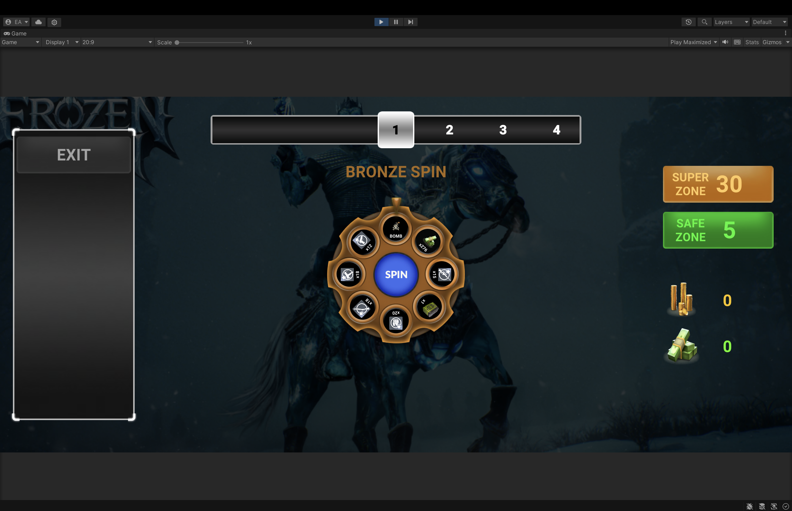
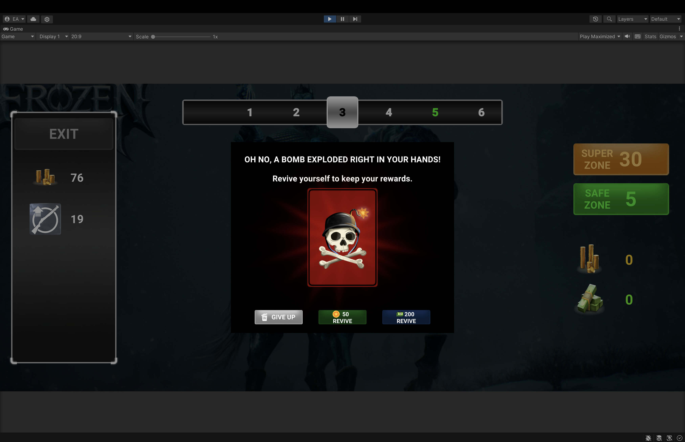
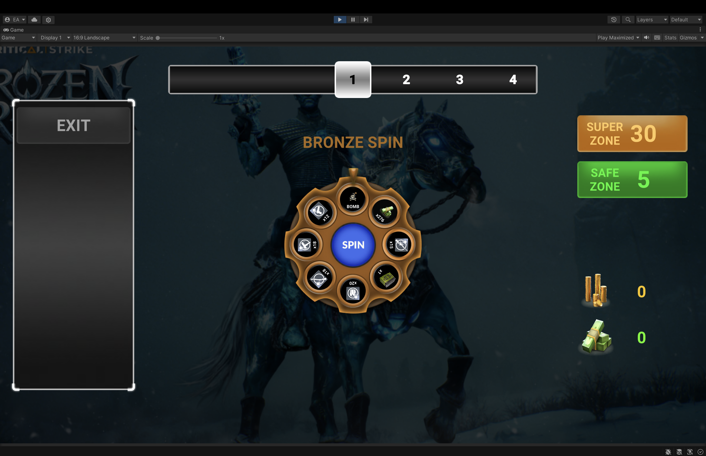
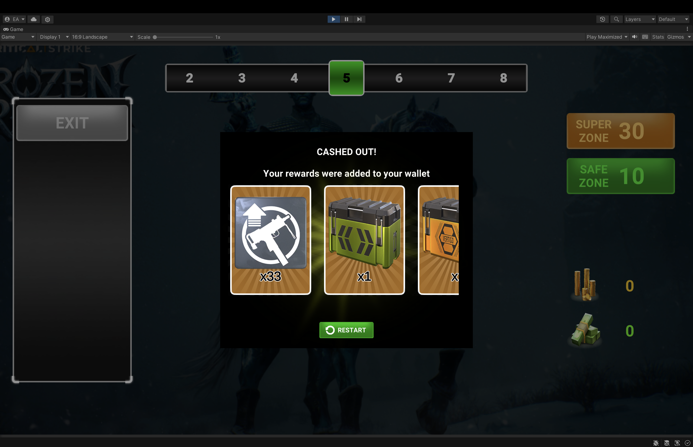
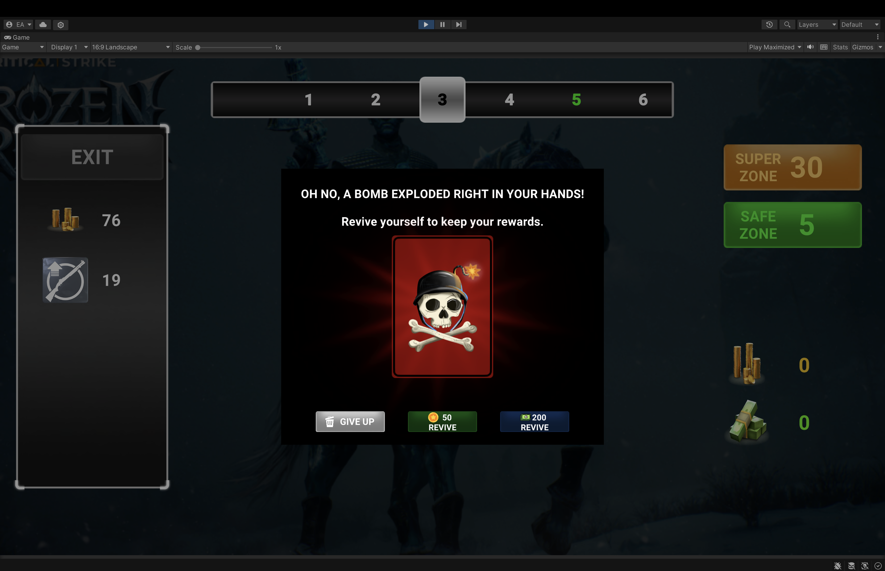
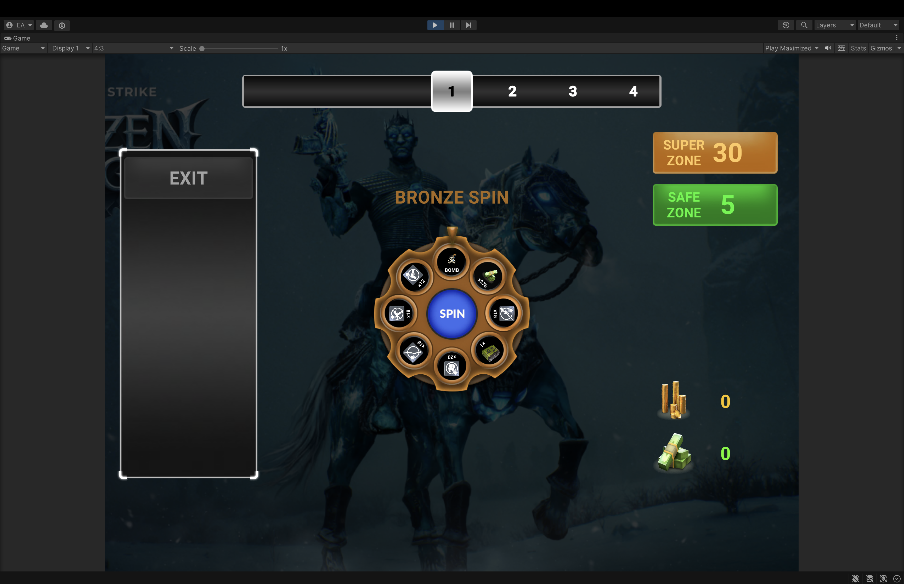
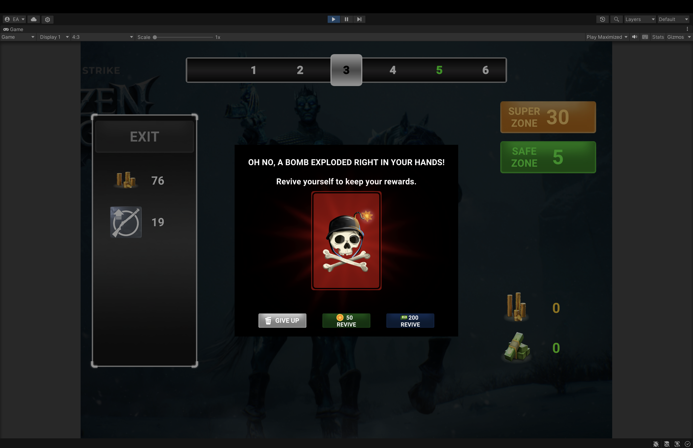

# Vertigo Games – Game Developer Case Study

This project is a game developer demo created as part of the Vertigo Games case study.

It is developed to demonstrate clean architecture, event-driven gameplay systems, and a complete playable loop.

---

## Core Features

- **Event-Driven Architecture**  
  All major systems communicate through a custom event system, keeping gameplay logic decoupled and modular.

- **Zone-Based Wheel Logic**  
  Wheel content adapts to the current zone state (Bronze / Safe / Super), with configurable reward items and zone-specific bomb rules.

- **Zone Progression System**  
  Zones increase only on successful spins.  
  - Safe zones prevent bomb outcomes  
  - Super zones offer higher tier rewards  

- **Reward Bank & Wallet Separation**  
  - Session rewards are collected in a temporary bank  
  - Rewards are transferred to a persistent wallet on exit  
  - Bomb hits clear the session bank unless revived

- **Fail & Revive Flow**  
  Bomb hits trigger a fail panel with options to:
  - Give up and restart the run
  - Revive using Gold or Cash (if available)

- **Summary Panel (Cash Out)**  
  When exiting in Safe or Super zones, a summary screen displays collected session rewards in a card-based layout.

- **ScriptableObject Driven Data**  
  Wheel items are defined using ScriptableObjects.

- **Sprite Atlas Optimization**  
  All item icons are packed using Unity Sprite Atlas.

- **Wheel Animations**  
  Wheel rotation is animated using DOTween.

---

## Technical Highlights

- Modular folder structure separating:
  - Runtime systems
  - UI
  - Data & configurations
  - Shared utilities and events
- No Unity Inspector OnClick usage  
  (All button bindings are handled via scripts)
- Fully responsive UI tested on:
  - 20:9 aspect ratio

  - 16:9 aspect ratio

  - 4:3 aspect ratios

---

## Build & Play

- Platform: **Android**
- Unity Version: **Unity 2021 LTS**
- A release APK is provided via GitHub Releases.
- Video link (Google drive): [Link](https://drive.google.com/file/d/1XEhn8O4DGUWqf-bHoMYznSH5cT4KXEsC/view?usp=sharing)